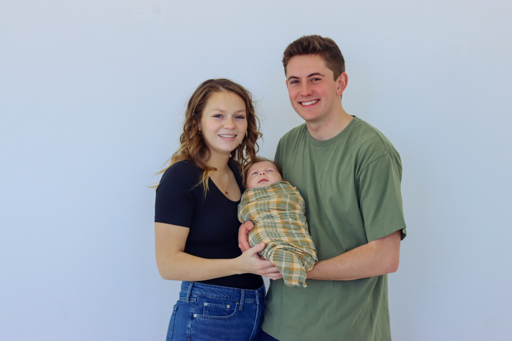

# About Me:

I am from Orem UT, and attended BYU - Idaho in Rexburg ID. There I met my wife, Violet, and a couple years later we had our son, Rudy.

I am a Bachelors of Science in Physics with a Mathematics Emphasis and a Computer Programming Certificate, all from BYU - Idaho. I am planning on going on to get my Masters of Science in Medical Physics. 

I am passionate about Physics, Math, and creativity. One of my hobbies is creating software. I am excited to one day work with cancer patients in the radiation oncology department, and help them receive cancer treatments to help them beat cancer. 
